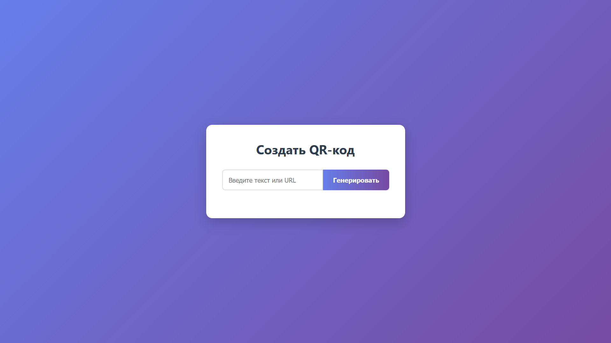
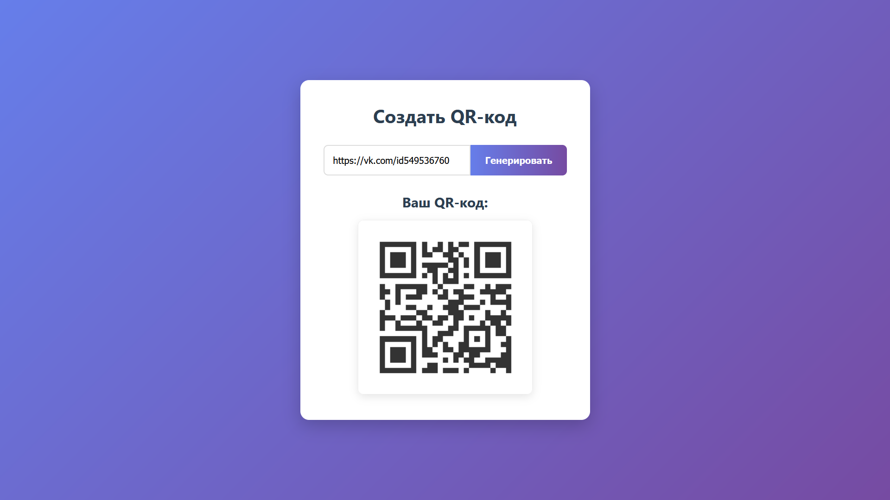

# 📷 Генератор QR-кодов (Go Web App)

Это простое, но функциональное веб-приложение для генерации QR-кодов. Пользователь вводит текст или URL, и приложение мгновенно создает соответствующий QR-код. Приложение написано на языке Go с использованием стандартной библиотеки `net/http` и библиотеки `github.com/skip2/go-qrcode`.

## 🎯 Особенности

- **Веб-интерфейс**: Удобная HTML-форма для ввода данных.
- **Мгновенная генерация**: QR-код генерируется и отображается без перезагрузки страницы (AJAX).
- **Настройка внешнего вида**: QR-коды имеют стильный серо-белый дизайн.
- **Адаптивный дизайн**: Интерфейс корректно отображается как на компьютерах, так и на мобильных устройствах.
- **Чистая архитектура**: Код структурирован по пакетам для лучшей поддержки и масштабируемости.

## 📸 Скриншоты

| Главная страница                 | Сгенерированный QR-код          |
| ------------------------------- | ------------------------------- |
|        |  |

## 🕹️ Использование

1. Откройте приложение в браузере (по умолчанию `http://localhost:8080`).
2. Введите любой текст или URL в поле ввода.
3. Нажмите кнопку "Генерировать".
4. QR-код появится ниже формы.

## 🚀 Установка и запуск

1. Убедитесь, что у вас установлен Go (https://golang.org/dl/).
2. Клонируйте репозиторий:

```bash
git clone https://github.com/Kirutka/QR-codes-generator
cd QR-codes-generator # например, go-qrcode-web
```

3. Установите зависимости:

```bash
go mod init qr
go mod tidy
```

4. Запустите приложение:

```bash
cd cmd
go run main.go
```

5. Откройте браузер и перейдите по адресу `http://localhost:8080`.

## 📦 Сборка

Для сборки исполняемого файла:

```bash
go build -o qrcode-web-app
```

## 🛠️ Технические детали

- **Язык**: Go
- **Веб-фреймворк**: `net/http` (стандартная библиотека)
- **Генерация QR-кодов**: `github.com/skip2/go-qrcode`
- **Frontend**: HTML, CSS, JavaScript (Fetch API)

## 📄 Лицензия

Этот проект распространяется под лицензией MIT. Подробнее см. в файле LICENSE.md